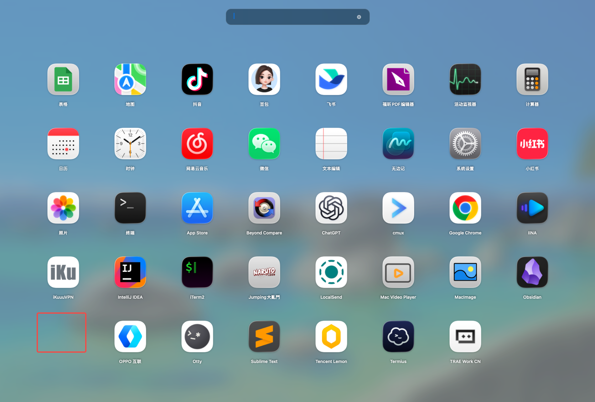

# Mac Launcher

[中文版](README.zh-CN.md)

Mac Launcher is a native, macOS-style application launcher built with AppKit. It presents the applications installed on the local Mac in a full-screen interface, with real application icons, fast search, paging animations, and persistent visibility settings.

> **Pinyin search is a highlight feature:** Chinese applications can be found with full pinyin (`beiwanglu`), spaced pinyin (`bei wang lu`), or initials (`bwl`).

## Screenshot



## Features

- Discovers applications from `/Applications`, `~/Applications`, and `/System/Applications`.
- Displays the real icon and display name for each local application.
- Provides a focused, left-aligned search field with a dark translucent native-style appearance.
- Filters applications as you type, including Chinese names entered as full pinyin, compact pinyin, or initials.
- Supports paging with the mouse wheel, trackpad scrolling, page dots, and horizontal slide animations.
- Uses fade-in and fade-out transitions when opening and dismissing the launcher.
- Opens an application when its icon is clicked.
- Dismisses when you click outside the application grid or press `Esc`.
- Keeps the launcher process running after dismissal so it can be reopened from the Dock.
- Exits completely only when you choose `Command-Q`.
- Includes a settings panel for searching and persistently hiding selected applications.
- Uses the custom paper-plane application icon from `native/Assets/Launched.png`.

## Requirements

- macOS 13.0 or later
- Apple Silicon Mac
- Xcode Command Line Tools (`clang`, `codesign`, and `hdiutil`)

## Build the DMG

Run the build script from the project directory:

```bash
./build-macos.sh
```

The script validates the launcher lifecycle, compiles the native AppKit application, embeds the icon and bundle metadata, applies an ad-hoc signature, and creates the disk image.

The output is:

```text
build/Mac-Launcher-1.5.6-arm64.dmg
```

Open the DMG and drag `Mac Launcher.app` to the `Applications` folder. The build is ad-hoc signed and is not notarized with an Apple Developer ID. On another Mac, macOS may ask you to approve the first launch in **System Settings → Privacy & Security**.

## Run the application directly

To compile the app and launch the resulting bundle:

```bash
./build-macos.sh
open "build/Mac Launcher.app"
```

The launcher scans installed applications in the background after the window appears, so the interface remains responsive while discovery completes.

## Browser preview

The repository also contains a lightweight browser preview of the launcher layout. It does not have access to the Mac's installed applications or native launch services.

```bash
python3 -m http.server 4173
```

Then open <http://localhost:4173> in a browser.

## Project structure

```text
native/LauncherApp.m       Native AppKit launcher implementation
native/Info.plist          Application bundle metadata
native/Assets/              Application icon assets
scripts/check-lifecycle.sh Regression checks for hide/reopen/quit behavior
build-macos.sh             Build, sign, and package script
index.html                 Browser preview entry point
script.js                  Browser preview behavior
styles.css                 Browser preview styles
```

## License

No license has been specified for this project yet.
